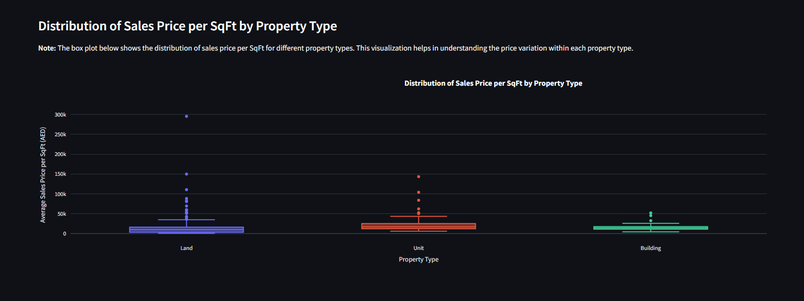
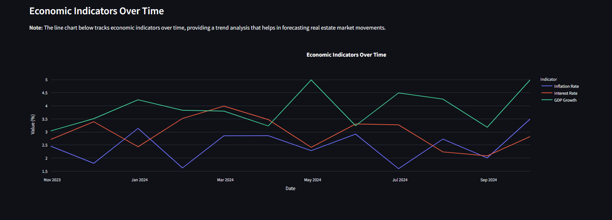

# 🏢 Dubai Real Estate Market Dashboard: Your Comprehensive Tool for Real-Time Insights 📈


## Table of Contents

- [Overview](#overview)
- [Features](#features)
- [Demo](#demo)
- [Installation](#installation)
- [Configuration](#configuration)
  - [API Integration](#api-integration)
- [Usage](#usage)
- [Data Processing Pipeline](#data-processing-pipeline)
- [Metrics Explained](#metrics-explained)
- [Data Visualization](#data-visualization)
- [Contributing](#contributing)
- [License](#license)
- [Contact](#contact)
- [Bonus Features](#bonus-features)

## Overview

Welcome to the **Dubai Real Estate Market Dashboard**—your ultimate solution for navigating the dynamic landscape of Dubai's property market. 🏢📊

Designed specifically for investors, real estate professionals, and market analysts, this dashboard transforms raw data into actionable insights, empowering you to make informed decisions with confidence. Whether you're comparing a 2-bedroom apartment in Business Bay to the Dubai average or tracking market trends in real-time, our dashboard provides the tools you need for comprehensive analysis.

Leveraging the capabilities of **Streamlit**, **Plotly**, and advanced data processing algorithms, this tool ensures you stay ahead of the curve with up-to-the-minute data visualizations and detailed metrics.

## Features

- **Real-Time Data Integration:** Seamlessly connect to the Dubai Land Department's API to ensure your data is always current.
- **Comprehensive Metrics:** Calculate and visualize key indices such as Sales Supply Index, Rental Supply Index, Gross Yield, and more across various levels—unit, building, area, and city.
- **Dynamic Visualizations:** Interactive charts and graphs powered by Plotly that update in real-time as new data becomes available.
- **User-Friendly Interface:** Intuitive layout with multiple tabs for organized and efficient data exploration.
- **Automated Data Processing:** Advanced algorithms for data cleaning, outlier detection, and feature engineering to maintain data quality and accuracy.
- **Downloadable Reports:** Easily export processed data and visualizations for further analysis or reporting purposes.
- **Enhanced Efficiency:** Swiftly perform complex calculations and gain insights that enhance your decision-making process in the real estate market.

## Demo
*Click here to see the Demo*


*Experience the power of real-time insights at your fingertips!*

## Installation

### Prerequisites

- **Python 3.12 or Higher:** Ensure Python is installed on your system. Download it from [Python's official website](https://www.python.org/downloads/).
- **Git:** For version control and cloning the repository. Download from [Git's official website](https://git-scm.com/downloads).

### Steps

1. **Clone the Repository**

   ```bash
   git clone https://github.com/tarekeesa/Real-State-Dashboard.git
   cd Real-State-Dashboard
   ```

2. **Create a Virtual Environment**

   It is recommended to use a virtual environment to manage dependencies.

   ```bash
   python -m venv venv
   ```

3. **Activate the Virtual Environment**

   - **Windows:**

     ```bash
     venv\Scripts\activate
     ```

   - **macOS/Linux:**

     ```bash
     source venv/bin/activate
     ```

4. **Install Dependencies**

   ```bash
   pip install -r requirements.txt
   ```

   *Ensure that the `requirements.txt` file includes all necessary packages such as `streamlit`, `pandas`, `numpy`, `plotly`, `requests`, etc.*

5. **Run the Streamlit App**

   ```bash
   streamlit run dashboard.py
   ```

   Replace `dashboard.py` with the name of your main Streamlit application script if different.

## Configuration

### API Integration

To ensure your dashboard reflects the latest data from the Dubai Land Department, follow these steps to integrate the API:

1. **Obtain API Access**

   - Visit the [Dubai Land Department Open Data](https://dubailand.gov.ae/en/open-data/real-estate-data/) to obtain access to transaction records and the RERA rental index.

2. **Set Up API Endpoints**

   - Replace the placeholder API URLs in the code with your actual API endpoints for transactions and rental data.

3. **Secure Your API Keys**

   - **Using Streamlit Secrets:**

     Create a `secrets.toml` file in the `.streamlit` directory of your project.

     ```toml
     # .streamlit/secrets.toml

     API_KEY = "your_actual_api_key_here"
     ```

   - **Accessing Secrets in Code:**

     ```python
     api_key = st.secrets["API_KEY"]
     ```

   - **Alternatively, Using Environment Variables:**

     ```bash
     export API_KEY="your_actual_api_key_here"
     ```

     And access it in your code:

     ```python
     import os

     api_key = os.getenv("API_KEY")
     ```

4. **Update API Data Loading Function**

   Ensure the `load_data_from_api` function in your code utilizes the secured API key.

   ```python
   @st.cache_data(show_spinner=False, ttl=3600)
   def load_data_from_api():
       logger.info("Fetching data from API")
       
       transactions_api_url = "https://api.yourdomain.com/transactions"
       rent_api_url = "https://api.yourdomain.com/rent"
       
       api_key = st.secrets["API_KEY"]  # Ensure this matches your secrets setup
       
       headers = {
           "Authorization": f"Bearer {api_key}"
       }
       
       try:
           response_transactions = requests.get(transactions_api_url, headers=headers)
           response_transactions.raise_for_status()
           transactions = pd.json_normalize(response_transactions.json())
           
           response_rent = requests.get(rent_api_url, headers=headers)
           response_rent.raise_for_status()
           rent = pd.json_normalize(response_rent.json())
           
           logger.info("Data fetched successfully from API")
           
           transactions.columns = transactions.columns.str.strip()
           rent.columns = rent.columns.str.strip()
           
           return transactions, rent
       except requests.exceptions.RequestException as e:
           logger.error(f"Error fetching data from API: {e}")
           st.error("Failed to fetch data from API. Please check the logs for more details.")
           return pd.DataFrame(), pd.DataFrame()
   ```

## Usage

1. **Select Data Source**

   On the sidebar, choose between loading data from **CSV Files** or via **API**.

   

2. **Load Data**

   - **CSV Files:** Ensure that the CSV files (`transactions-YYYY-MM-DD.csv` and `rent.csv`) are placed in the `data/` directory.
   - **API:** Ensure API integration is configured as per the [API Integration](#api-integration) section.

3. **Manual Data Refresh**

   If you're using the **API** data source, you can manually refresh the data by clicking the "Refresh Data" button on the sidebar.

4. **Navigate Through Tabs**

   Explore different aspects of the real estate market through the various tabs:

   - **Overview:** High-level KPIs and summary metrics.
   - **Supply Indexes:** Analysis of property supply in the market.
   - **Pricing Metrics:** Insights into sales and rental pricing.
   - **Rental & Economic Indicators:** Evaluation of rental market and economic factors.
   - **Yield Analysis:** Assessment of investment profitability.
   - **Detailed Analysis:** In-depth exploration of specific segments.
   - **Data Anomalies:** Identification of outliers and data quality issues.
   - **Data Tables:** Access to processed and source data tables with download options.

## Data Processing Pipeline

As your dedicated data analyst, here's how raw data is transformed into actionable insights:

1. **Data Collection:**
   - **CSV Files:** Import historical transaction and rental data.
   - **API Integration:** Fetch real-time data from the Dubai Land Department's API.

2. **Data Cleaning:**
   - **Standardization:** Normalize categorical columns for consistency.
   - **Filtering:** Select data within the specified analysis period.
   - **Outlier Detection:** Identify and handle anomalies using IQR and other statistical methods.

3. **Feature Engineering:**
   - **Date Extraction:** Derive month and year from date fields.
   - **Metric Calculations:** Compute essential indices like Sales Supply Index, Rental Supply Index, Gross Yield, etc.

4. **Index Calculations:**
   - **Sales Supply Index:** Measures property availability for sale.
   - **Rental Supply Index:** Measures property availability for rent.
   - **Rental vs. Sales Supply Index:** Compares rental and sales market trends.
   - **Asking Prices:** Monitors sales and rental prices per SqFt and in total AED.
   - **Gross Yield:** Calculates rental yield based on both per SqFt and absolute prices.

5. **Data Visualization:**
   - **Dynamic Charts:** Create interactive and real-time visualizations using Plotly.
   - **Dashboard Updates:** Ensure the dashboard reflects the latest data automatically.

## Metrics Explained

### 1. **Sales Supply Index**

**Tracks the availability of properties for sale over time.**

**Formula:**
\[ \text{Sales Supply Index} = \frac{\text{Number of Properties Listed for Sale in the Period}}{\text{Total Number of Properties in the Market}} \]

**Levels:** Unit, Building, Area, City

### 2. **Rental Supply Index**

**Tracks the availability of rental properties over time.**

**Formula:**
\[ \text{Rental Supply Index} = \frac{\text{Number of Properties Listed for Rent in the Period}}{\text{Total Number of Properties in the Market}} \]

**Levels:** Unit, Building, Area, City

### 3. **Rental vs. Sales Supply Index**

**Compares the trends between rental and sales markets.**

**Formula:**
\[ \text{Rent vs Sales Supply Index} = \frac{\text{Number of Properties Listed for Rent}}{\text{Number of Properties Listed for Sale}} \]

**Levels:** Unit, Building, Area, City

### 4. **Sales Asking Price (AED/SqFt)**

**Monitors trends in property prices per square foot for sales listings.**

**Formula:**
\[ \text{Sales Asking Price per Sqft} = \frac{\text{Property Sale Asking Price in AED}}{\text{Property Size in Sqft}} \]

**Levels:** Unit, Building, Area, City

### 5. **Rental Asking Price (AED/SqFt)**

**Monitors trends in rental prices per square foot.**

**Formula:**
\[ \text{Rental Asking Price per Sqft} = \frac{\text{Rental Asking Price in AED}}{\text{Property Size in Sqft}} \]

**Levels:** Building, Area, City

### 6. **Sales Asking Price (AED)**

**Monitors trends in property prices for sales listings.**

**Formula:**
\[ \text{Sales Asking Price (AED)} = \text{Property Sale Asking Price in AED} \]

**Levels:** Unit, Building, Area, City

### 7. **Rental Asking Price (AED)**

**Monitors trends in rental prices.**

**Formula:**
\[ \text{Rental Asking Price (AED)} = \text{Rental Asking Price in AED} \]

**Levels:** Unit, Building, Area, City

### 8. **Gross Yield (%) on Asking Price (AED/SqFt)**

**Calculates rental yield for properties using price per square foot.**

**Formula:**
\[ \text{Gross Yield On Asking Price (AED/Sqft)} = \frac{\text{Annual Rental Asking Price (AED/Sqft)}}{\text{Sales Asking Price (AED/Sqft)}} \]

**Levels:** Unit, Building, Area, City

### 9. **Gross Yield (%) on Asking Price (AED)**

**Calculates rental yield using absolute rental and sales prices.**

**Formula:**
\[ \text{Gross Yield On Asking Price (AED)} = \frac{\text{Annual Rental Asking Price (AED)}}{\text{Sales Asking Price (AED)}} \]

**Levels:** Unit, Building, Area, City

### 10. **Access to Off-Market and Distressed Properties**

**Identifies off-market or distressed property opportunities.**

**Strategy:**
- **Off-Market Properties:** Detect properties not listed for sale or rent but available through proprietary channels.
- **Distressed Properties:** Identify properties undergoing financial distress, foreclosures, or requiring significant renovations.

## Data Visualization

Utilizing advanced visualization tools, the dashboard brings data to life through:

- **Interactive Dashboards:** Navigate through multiple tabs to explore different metrics seamlessly.
- **Real-Time Charts:** Visualize trends as they occur with automatic updates from the API.
- **Dynamic Filters:** Customize views based on area, property type, and other relevant parameters.
- **Comprehensive Graphs:** Employ a variety of chart types including bar charts, line graphs, scatter plots, histograms, pie charts, box plots, and heatmaps to effectively represent data.








*Observe how data transforms into insightful visualizations!*

## Contributing

Collaboration is essential for enhancing the functionality and effectiveness of the Dubai Real Estate Market Dashboard. Your contributions are highly valued! 🛠️🤝

### Steps to Contribute

1. **Fork the Repository**

   Click the "Fork" button at the top-right corner of this repository to create your personal copy.

2. **Clone the Forked Repository**

   ```bash
   git clone https://github.com/tarekeesa/Real-State-Dashboard.git
   cd Real-State-Dashboard
   ```

3. **Create a New Branch**

   ```bash
   git checkout -b feature/YourFeatureName
   ```

4. **Make Changes**

   Implement your feature or fix. Ensure your code adheres to the project's coding standards.

5. **Commit Changes**

   ```bash
   git add .
   git commit -m "Add detailed description of your changes"
   ```

6. **Push to Your Fork**

   ```bash
   git push origin feature/YourFeatureName
   ```

7. **Create a Pull Request**

   Navigate to the original repository and create a pull request from your forked repository.

### Guidelines

- **Code Quality:** Maintain high code quality with clear documentation and comments.
- **Testing:** Ensure new features are thoroughly tested before submission.
- **Documentation:** Update the README and other relevant documentation to reflect your changes.

## License

This project is licensed under the [MIT License](LICENSE).

## Contact

**Developed by:** Tarek Eissa 🦸‍♂️

- **Email:** tarekeesa7@gmail.com
- **LinkedIn:** [linkedin.com/in/tarek-eissa](https://www.linkedin.com/in/tarek-eissa-98311b244?lipi=urn%3Ali%3Apage%3Ad_flagship3_profile_view_base_contact_details%3BkZz%2BBU0ySQeNuX2aOK4Klg%3D%3D)
- **GitHub:** [github.com/tarekeesa](https://github.com/tarekeesa)

*Feel free to reach out for any queries, suggestions, or collaboration opportunities! Together, we'll excel in the Dubai real estate market.*

## Bonus Features

To further enhance the dashboard's capabilities and provide even more value to users, the following advanced features are under consideration:

### 1. **Advanced Predictive Analytics**

Incorporate machine learning models to forecast market trends and predict future property values. This allows investors to make proactive decisions based on anticipated market movements.

### 2. **Anomaly Detection for Market Insights**

Utilize sophisticated anomaly detection algorithms to identify unusual market behaviors, such as sudden price spikes or atypical rental patterns, enabling swift strategic adjustments.

### 3. **Customized Investment Recommendations**

Develop personalized investment recommendations based on user preferences, risk tolerance, and current market conditions, leveraging collaborative filtering and recommendation systems.

### 4. **Heatmaps for Geographic Insights**

Enhance visualizations with heatmaps that display concentrations of sales, rentals, and yields across different areas, providing a geographic perspective on market dynamics.

### 5. **Integration with Virtual Tours**

Link property listings to virtual tours, allowing investors and potential buyers to explore properties remotely and gain a comprehensive understanding of potential investments.